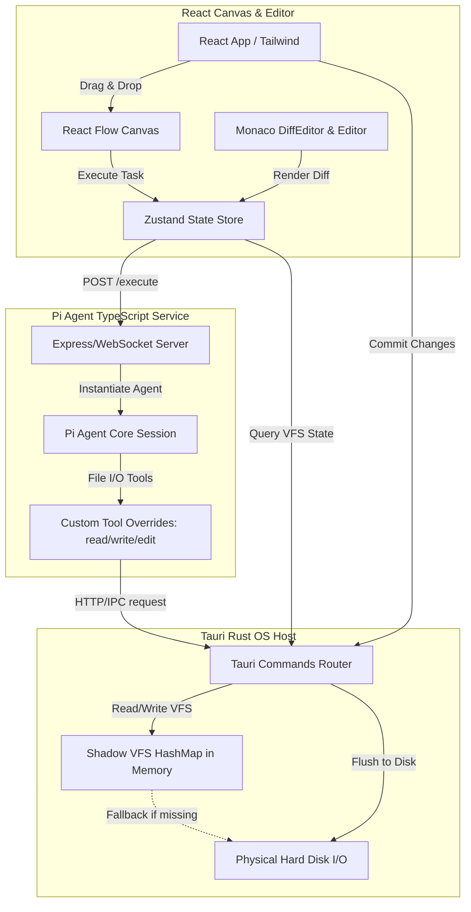

# Complete Implementation Plan: AI Spatial Orchestrator

This document details the step-by-step technical plan for implementing the **AI Spatial Orchestrator**—a desktop-native, spatial IDE featuring an infinite canvas workflow for orchestrating multi-file code refactoring using Tauri, React, React Flow, Monaco Editor, and a Node.js sidecar running the Pi Agent SDK.

---

## 1. System Architecture

The following diagram illustrates how the frontend React canvas, the Tauri Rust backend, and the Node.js Pi agent sidecar interact.



---

## 2. Phase-by-Phase Execution Steps

### Phase 1: Project Initialization & Environment Setup
1. **Initialize Tauri 2.0 app** with React, TypeScript, and Vite inside the workspace root.
2. **Setup directories**:
   - `src-tauri/` - Rust Tauri backend
   - `src/` - React frontend
   - `agent-sidecar/` - Node.js TypeScript server for the Pi agent
3. **Install Frontend Dependencies**:
   - Web framework: `@xyflow/react` (React Flow), `@monaco-editor/react`, `zustand`, `lucide-react`, `tailwindcss`, `postcss`, `autoprefixer`.
4. **Install Agent Sidecar Dependencies**:
   - Express server, WebSockets, TypeScript, `@earendil-works/pi-agent-core`, `@earendil-works/pi-coding-agent`, `@earendil-works/pi-ai`.

---

### Phase 2: Tauri Rust Backend & Shadow VFS

To allow the AI to safely perform edits in a sandboxed, reviewable environment, we implement a memory-only Virtual File System (VFS) that overlays the actual disk.

#### Files to Create/Modify:
* **[NEW] [src-tauri/src/main.rs](file:///Users/suciuvictortraian/Development/axiom/src-tauri/src/main.rs)**
  Implement the core Rust state structure:
  ```rust
  use serde::{Serialize, Deserialize};
  use std::collections::HashMap;
  use std::sync::{Arc, Mutex};
  use std::path::{Path, PathBuf};

  // Thread-safe map storing modified/unapplied files (File Path -> Code Content)
  pub struct VfsState(pub Arc<Mutex<HashMap<PathBuf, String>>>);

  #[tauri::command]
  fn read_file_vfs(state: tauri::State<'_, VfsState>, path: String) -> Result<String, String> {
      let vfs = state.0.lock().map_err(|e| e.to_string())?;
      let path_buf = PathBuf::from(&path);
      
      // 1. Check VFS memory first
      if let Some(content) = vfs.get(&path_buf) {
          return Ok(content.clone());
      }
      
      // 2. Fall back to physical disk
      if path_buf.exists() {
          std::fs::read_to_string(&path_buf).map_err(|e| e.to_string())
      } else {
          Err("File not found".into())
      }
  }

  #[tauri::command]
  fn write_file_vfs(state: tauri::State<'_, VfsState>, path: String, content: String) -> Result<(), String> {
      let mut vfs = state.0.lock().map_err(|e| e.to_string())?;
      let path_buf = PathBuf::from(&path);
      vfs.insert(path_buf, content);
      Ok(())
  }

  #[tauri::command]
  fn apply_vfs_to_disk(state: tauri::State<'_, VfsState>) -> Result<(), String> {
      let mut vfs = state.0.lock().map_err(|e| e.to_string())?;
      for (path, content) in vfs.drain() {
          if let Some(parent) = path.parent() {
              std::fs::create_dir_all(parent).map_err(|e| e.to_string())?;
          }
          std::fs::write(&path, content).map_err(|e| e.to_string())?;
      }
      Ok(())
  }

  #[tauri::command]
  fn get_directory_structure(root_dir: String) -> Result<Vec<FileEntry>, String> {
      // Recursively traverses the root_dir, returning a nested JSON structure
      // for the React file explorer sidebar.
  }
  ```

---

### Phase 3: Pi Agent Node.js Sidecar

The Pi agent runs in Node.js and requires custom tools that interface with Tauri's Rust endpoints, preventing the agent from modifying the physical disk directly during execution.

#### Files to Create/Modify:
* **[NEW] [agent-sidecar/package.json](file:///Users/suciuvictortraian/Development/axiom/agent-sidecar/package.json)**: Core package file defining typescript and Pi dependencies.
* **[NEW] [agent-sidecar/src/server.ts](file:///Users/suciuvictortraian/Development/axiom/agent-sidecar/src/server.ts)**
  Establish an Express/WebSocket server and configure custom tool wrappers:
  ```typescript
  import express from 'express';
  import { createAgentSessionRuntime } from '@earendil-works/pi-agent-core';
  import axios from 'axios';

  const app = express();
  app.use(express.json());

  // Define custom read/write tools that redirect to Tauri's VFS REST endpoints
  const customReadTool = {
      name: 'read_file',
      description: 'Read the contents of a file in the workspace.',
      execute: async ({ path }: { path: string }) => {
          const response = await axios.post('http://localhost:3030/vfs/read', { path });
          return response.data.content;
      }
  };

  const customWriteTool = {
      name: 'write_file',
      description: 'Write or create a file in the workspace.',
      execute: async ({ path, content }: { path: string, content: string }) => {
          await axios.post('http://localhost:3030/vfs/write', { path, content });
          return { success: true };
      }
  };

  app.post('/execute-node', async (req, res) => {
      const { nodeId, instructions, model, attachedFiles, customProvider } = req.body;
      try {
          // If a custom provider configuration is supplied dynamically by the client UI
          // (e.g. Ollama, OpenRouter, custom OpenAI-compliant endpoints)
          if (customProvider) {
              const { registerProvider } = require('@earendil-works/pi-agent-core');
              registerProvider(customProvider.id, {
                  name: customProvider.name,
                  baseUrl: customProvider.baseUrl, // e.g. "http://localhost:11434/v1" for Ollama
                  apiKey: customProvider.apiKey || 'not-needed',
                  api: customProvider.apiType || 'openai-completions',
                  models: customProvider.models // Array of models supported, e.g. [{ id: 'qwen2.5-coder:7b', name: 'Qwen 2.5 Coder' }]
              });
          }

          const runtime = await createAgentSessionRuntime({
              tools: [customReadTool, customWriteTool],
              modelName: model, // e.g., 'anthropic/claude-3-5-sonnet' or 'ollama/qwen2.5-coder:7b'
              systemPrompt: `You are an AI coding agent operating inside a spatial canvas. Update the attached files according to instructions: ${instructions}`
          });
          
          const result = await runtime.run();
          res.json({ success: true, result });
      } catch (err: any) {
          res.status(500).json({ error: err.message });
      }
  });

  app.listen(4000, () => console.log('Pi Sidecar listening on port 4000'));
  ```

#### Multi-LLM Integration Details

The Pi framework utilizes a unified API compatibility layer that normalizes calls across different model families. To integrate any other LLM provider (Ollama, OpenRouter, LM Studio, vLLM, custom private endpoints):

1. **Option A: Static config (`models.json`)**
   You can place a configuration file at `~/.pi/agent/models.json` which the Pi agent core reads automatically. Example layout for a local Ollama server:
   ```json
   {
     "providers": {
       "ollama": {
         "baseUrl": "http://localhost:11434/v1",
         "api": "openai-completions",
         "apiKey": "ollama",
         "compat": {
           "supportsDeveloperRole": false,
           "supportsReasoningEffort": false
         },
         "models": [
           {
             "id": "qwen2.5-coder:7b",
             "name": "Qwen 2.5 Coder (7B)",
             "contextWindow": 32000
           }
         ]
       }
     }
   }
   ```

2. **Option B: Dynamic Registration via Frontend UI**
   - The React UI can expose a **Settings Panel** allowing the user to configure custom providers (e.g. naming the provider, entering a custom API base URL, entering an API key, and listing supported models).
   - This configuration object is stored in the Zustand store and sent inside the body of the `POST /execute-node` API request.
   - The sidecar intercepts this and registers the provider dynamically in Pi's runtime before creating the session.
   - Models are then referenced as `[providerId]/[modelId]` (e.g., `ollama/qwen2.5-coder:7b`).

---

### Phase 4: Frontend State and Canvas Layout

We build a sleek dark-themed workspace layout:
- **Left Sidebar**: File explorer with search & drag-and-drop support.
- **Center Canvas**: Infinite grid with React Flow custom nodes.
- **Right Side-Pane**: Collapsible visual diff manager and chat.

#### Files to Create/Modify:
* **[NEW] [src/store.ts](file:///Users/suciuvictortraian/Development/axiom/src/store.ts)**: Zustand state configuration.
  ```typescript
  import { create } from 'zustand';
  import { Node, Edge, Connection } from '@xyflow/react';

  interface WorkspaceState {
      rootPath: string;
      nodes: Node[];
      edges: Edge[];
      selectedNodeId: string | null;
      setNodes: (nodes: Node[]) => void;
      setEdges: (edges: Edge[]) => void;
      setSelectedNodeId: (id: string | null) => void;
      addFileNode: (path: string, x: number, y: number) => void;
      addTaskNode: (x: number, y: number) => void;
  }
  // Implement state mutators...
  ```
* **[NEW] [src/components/FileTree.tsx](file:///Users/suciuvictortraian/Development/axiom/src/components/FileTree.tsx)**: Render filesystem hierarchy; files are draggable.
* **[NEW] [src/components/TaskNode.tsx](file:///Users/suciuvictortraian/Development/axiom/src/components/TaskNode.tsx)**: Renders the prompt query textbox, execute button, and status badges on the React Flow canvas.
* **[NEW] [src/components/FileNode.tsx](file:///Users/suciuvictortraian/Development/axiom/src/components/FileNode.tsx)**: Custom node visualizer showing filename and brief snippet preview.
* **[NEW] [src/components/SidePane.tsx](file:///Users/suciuvictortraian/Development/axiom/src/components/SidePane.tsx)**: Slide-out pane housing Monaco `<DiffEditor />` and node-specific chat interface.
* **[NEW] [src/index.css](file:///Users/suciuvictortraian/Development/axiom/src/index.css)**: Sleek dark-mode tokens, custom glassmorphism effects, grid backgrounds, and canvas node transitions.

---

### Phase 5: Pipeline Diffing, Inter-Node Chaining, & Execution

1. **DAG Topological Runner**:
   - When "Execute Pipeline" is clicked, traverse the React Flow node/edge graph topologically.
   - Run task nodes sequentially (e.g., execute Node A, pass output VFS state to Node B).
2. **State Diffing View**:
   - The React UI reads the file contents before the task node executed (original disk or previous node's VFS snapshot) and compares it with the new VFS state returned by the Pi sidecar.
   - Show this in Monaco DiffEditor.
3. **Save/Flush Execution**:
   - Call Tauri's `apply_vfs_to_disk` command to permanently save all cumulative changes to physical memory.

---

## 3. Verification Plan

### Automated Verification
- **Rust Unit Tests**:
  - Run `cargo test` in the `src-tauri` directory.
  - Tests will validate VFS CRUD operations, verifying that reads/writes successfully update the in-memory map without affecting dummy test files on the hard drive.
- **Frontend Build Validation**:
  - Run `npm run build` to verify TypeScript compile-time safety and bundler compilation.

### Manual Verification
1. **Physical Isolation Check**:
   - Drag a dummy file `test.txt` from the tree to the canvas.
   - Attach a Task Node with instructions: "Append Hello World to test.txt".
   - Click "Execute". Check that the UI's Monaco DiffEditor shows the added line.
   - Verify using `cat test.txt` in a terminal window that the actual file is still empty.
   - Click "Apply Pipeline" and verify the changes now appear in the physical file.
2. **Node Inter-dependency Validation**:
   - Connect Node A (editing `helper.ts`) to Node B (editing `index.ts`).
   - Run execution on Node A, then run Node B.
   - Verify Node B's code diff correctly references the updated helper function signature from Node A's output state.
3. **Spatial Interaction**:
   - Double-click canvas to spawn new task nodes.
   - Pan and zoom to check layout responsiveness.
