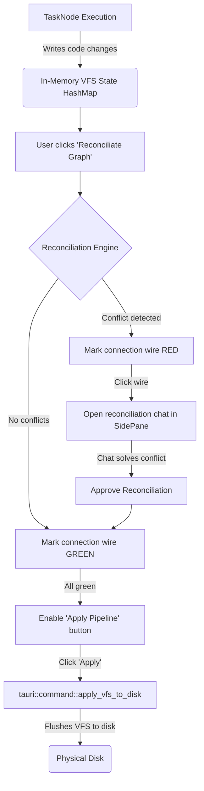

# Architecture Proposal: Graph Reconciliation & Virtual Workspace Buffers

This document contains the detailed design and implementation paths for the **Virtual Workspace Buffer** and **Graph Reconciliation** system.

---

## 1. Core Workflow & Architectural Flow

The workflow leverages the existing Tauri in-memory VFS (Virtual File System) cache. Code changes from independent tasks are modeled in memory, analyzed along sequence wires, and committed to local disk only when the entire pipeline is reconciled.



---

## 2. Technical Component Design

### A. Virtual Buffer Management (Tauri VFS State)
The Tauri backend has a virtual cache state that stores uncommitted modifications:
- `read_file_vfs`: Reads from VFS cache Map if present, otherwise falls back to physical disk.
- `write_file_vfs`: Writes strictly to the VFS cache Map.
- `apply_vfs_to_disk`: Flushes all VFS changes to physical local disk.

#### Per-Node Isolation
To prevent `TaskNode` B from reading `TaskNode` A's un-reconciled changes prematurely, extend `VfsState` in `src-tauri/src/lib.rs` to support isolation:
```rust
pub struct VfsState(pub Arc<Mutex<HashMap<String, HashMap<String, String>>>>); 
// Mapping: HashMap<TaskNodeID, HashMap<FilePath, FileContent>>
```

---

### B. Reconciliation Engine
The reconciliation engine traverses the sequence wires (connections between `TaskNode`s) to validate compatibility.

1. **Scan Sequence Wires**:
   Select edges connecting Task outputs to Task inputs:
   ```typescript
   const sequenceEdges = edges.filter(e => e.sourceHandle === "task-out" && e.targetHandle === "task-in");
   ```
2. **AI Alignment Check**:
   For each connection, trigger a sidecar check:
   ```json
   {
     "type": "reconciliate_edge",
     "edgeId": "edge_123",
     "sourceTaskId": "task_1",
     "targetTaskId": "task_2",
     "modifiedFiles": ["src/components/Button.tsx"]
   }
   ```
   The sidecar prompts the LLM to inspect the differences made by `task_1` inside `Button.tsx` against the specifications of `task_2`, returning conflicts if they do not align.

---

### C. Visual Wire States (React Flow Custom Edges)
Custom styles are used on connection wires depending on their reconciliation status:

1. **State Definition**:
   ```typescript
   export interface CustomEdge extends Edge {
     data?: {
       status: "unreconciled" | "reconciled" | "idle";
       conflicts?: string;
     }
   }
   ```
2. **Visual Colors**:
   - `status === "unreconciled"` $\rightarrow$ Stroke color `#EF4444` (red) with animated dash-arrays.
   - `status === "reconciled"` $\rightarrow$ Stroke color `#10B981` (emerald green).
   - `status === "idle"` $\rightarrow$ Stroke color `#6366F1` (standard indigo).

---

### D. Side-Pane Chat Inspector for Wires
Clicking a **Red Wire** opens the chat pane on the right:
1. Initialize chat context with the code differences from the source task, the specifications of the target task, and any user feedback.
2. Once the LLM generates an aligning diff and the user clicks **Approve Reconciliation**, update the edge to `status: "reconciled"` and color the wire **green**.

---

## 3. Step-by-Step Implementation Guide

1. **Extend store.ts**:
   Add states representing `selectedEdgeId` and actions like `setEdgeStatus`, `reconciliateAllEdges`, and `mergeEdgeVfs`.
2. **Create custom ReconciliationEdge Component**:
   Register a custom edge renderer in React Flow using `@xyflow/react` to render glowing red/green paths.
3. **Build the Edge Inspector Chat Panel**:
   Configure `<EdgeInspectorPane edgeId={selectedEdgeId} />` in the sidebar to review logs and resolve clashes.
4. **Wire Sidecar Endpoints**:
   Add the `reconciliate_edge` handler inside `agent-sidecar/src/server.ts` to query the LLM model.
5. **Connect VFS Apply trigger**:
   Only enable the "Apply Pipeline" button in the frontend when all task nodes and wires are green.
